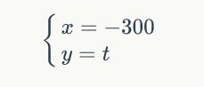

# A Birthday Gift

This is a birthday gift with js and css.
 
The project including: 

- `index.html` -- the main page
- `css/` -- the directory of css style files
- `js/` -- the directory of js files
        
The `.js/.css` is the minimize version of `_dev.js/_dev.css`

If you want to modify this projec for someone else, the simplest way is
to modify the get functions(like `getNameH1()` and so on) which indicate the stroke of word.

For example, the first stroke of **H** is a vertical line, so we can use a curvilinear equation to denote it like:

<a href="https://www.codecogs.com/eqnedit.php?latex=\begin{cases}&space;x=&space;-300\\&space;y&space;=&space;t&space;\end{cases}" target="_blank"></a>


then you can define the funtion like this:

```
function getNameH1(angle) {
    var x = -300;
    var y = angle;
    return new Array(offsetX + x, offsetY + y);
}
```